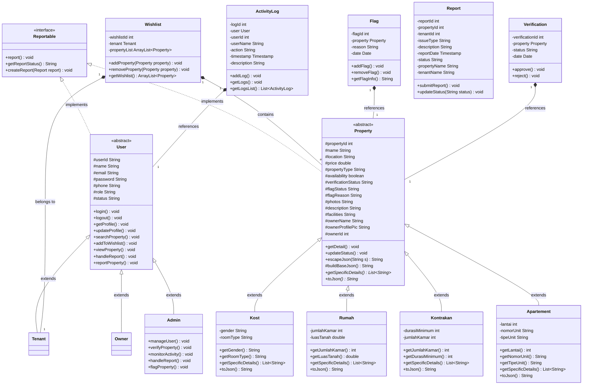

# 📁 DOKUMENTASI KELAS MODEL — SewaIn

Dokumen ini berisi penjelasan terperinci mengenai seluruh kelas yang berada dalam package `model` (`src/java/model/`) pada aplikasi SewaIn. Model-model ini bertindak sebagai representasi data dan logika bisnis inti (Domain Objects) dalam arsitektur Model-View-Controller (MVC) aplikasi.

---

## 🗺️ Diagram Relasi Kelas (UML)

Berikut adalah visualisasi hubungan pewarisan, implementasi interface, dan asosiasi antar kelas model di SewaIn:

---

## 🛠️ Interface Kontrak Polimorfisme

### 1. `Reportable.java`
* **Path:** `src/java/model/Reportable.java`
* **Tipe:** `Interface`
* **Deskripsi:** Kontrak abstraksi untuk semua objek yang dapat dilaporkan di dalam sistem (misalnya pengguna melanggar aturan atau properti bermasalah/scam).
* **Metode Kontrak:**
  * `void report()`: Memicu aksi pelaporan dasar.
  * `String getReportStatus()`: Mendapatkan status laporan.
  * `void createReport(Report report)`: Mendaftarkan data laporan formal berbasis kelas `Report`.

---

## 👤 Hierarki Kelas Pengguna (User Hierarchy)

### 2. `User.java` (Abstract Class)
* **Path:** `src/java/model/User.java`
* **Tipe:** `Abstract Class` (mengimplementasikan `Reportable`)
* **Deskripsi:** Kelas induk abstrak yang memuat atribut dasar dan operasi bersama untuk semua jenis aktor sistem (Tenant, Owner, Admin).
* **Atribut Terenkapsulasi (Protected):**
  * `userId` (`String`): ID unik pengguna.
  * `name` (`String`): Nama lengkap pengguna.
  * `email` (`String`): Alamat email (digunakan untuk kredensial login).
  * `password` (`String`): Kata sandi terenkripsi.
  * `phone` (`String`): Nomor telepon aktif pengguna.
  * `role` (`String`): Peran pengguna (`tenant`, `owner`, `admin`).
  * `status` (`String`): Status aktif akun (`Active`, `Suspended`).
* **Konstruktor:**
  * `User()`: Konstruktor default.
  * `User(String userId, String name, String email, String password, String phone, String role)`: Konstruktor berparameter.
* **Metode Umum:**
  * Getter dan Setter untuk seluruh atribut.
  * `void login()` / `void logout()`: Simulasi proses login/logout.
  * `void getProfile()` / `void updateProfile()`: Manajemen profil dasar.
  * **Metode Naik dari Subclass (Pull-Up Methods):** Untuk mencegah duplikasi kode di tingkat controller/JSP:
    * `void searchProperty()`
    * `void addToWishlist()`
    * `void viewProperty()`
    * `void handleReport()`
    * `void reportProperty()`
  * **Implementasi Kontrak `Reportable`:**
    * `@Override void report()`
    * `@Override String getReportStatus()`
    * `@Override void createReport(Report report)`

### 3. `Tenant.java` (Concrete Subclass)
* **Path:** `src/java/model/Tenant.java`
* **Tipe:** `Concrete Class` (turunan dari `User`)
* **Deskripsi:** Merepresentasikan aktor penyewa properti. Memiliki akses ke fitur pencarian properti, manajemen wishlist, pemesanan, dan pembuatan laporan keluhan.
* **Konstruktor:**
  * `Tenant()`: Memanggil `super()`.
  * `Tenant(String userId, String name, String email, String password, String phone, String role)`: Memanggil konstruktor berparameter induk (`super`).

### 4. `Owner.java` (Concrete Subclass)
* **Path:** `src/java/model/Owner.java`
* **Tipe:** `Concrete Class` (turunan dari `User`)
* **Deskripsi:** Merepresentasikan aktor pemilik properti sewa yang dapat memposting, memperbarui, dan menghapus data properti mereka sendiri.
* **Konstruktor:**
  * `Owner()`: Memanggil `super()`.
  * `Owner(String userId, String name, String email, String password, String phone, String role)`: Memanggil konstruktor berparameter induk (`super`).

### 5. `Admin.java` (Concrete Subclass)
* **Path:** `src/java/model/Admin.java`
* **Tipe:** `Concrete Class` (turunan dari `User`)
* **Deskripsi:** Merepresentasikan administrator platform dengan kontrol penuh atas moderasi sistem (manajemen pengguna, verifikasi properti baru, penanganan laporan, penandaan properti melanggar, dan monitoring log aktivitas).
* **Metode Spesifik:**
  * `void manageUser()`: Operasi manajemen status suspensi pengguna.
  * `void verifyProperty()`: Operasi peninjauan status kelayakan properti baru.
  * `void monitorActivity()`: Memantau riwayat log admin.
  * `void handleReport()`: Menyelesaikan keluhan laporan pelanggaran dari tenant.
  * `void flagProperty()`: Menandai properti berbahaya/spam.

---

## 🏠 Hierarki Kelas Properti (Property Hierarchy)

Sistem SewaIn menggunakan pola **Single Table Inheritance (STI)** di database. Seluruh subclass `Property` dipetakan ke dalam satu tabel fisik `properties`.

### 6. `Property.java` (Abstract Class)
* **Path:** `src/java/model/Property.java`
* **Tipe:** `Abstract Class` (mengimplementasikan `Reportable`)
* **Deskripsi:** Kelas induk abstrak yang memuat seluruh atribut dasar properti dan menyediakan implementasi pembentukan JSON polimorfik.
* **Atribut Terenkapsulasi (Protected):**
  * `propertyId` (`int`): ID unik properti (Auto Increment di database).
  * `ownerId` (`int`): ID pemilik properti.
  * `name` (`String`): Nama properti.
  * `location` (`String`): Alamat/Lokasi properti.
  * `price` (`double`): Tarif sewa bulanan.
  * `propertyType` (`String`): Discriminator STI (`kost`, `rumah`, `kontrakan`, `apartement`).
  * `availability` (`boolean`): Ketersediaan unit properti.
  * `verificationStatus` (`String`): Status peninjauan admin (`Pending`, `Approved`, `Rejected`).
  * `flagStatus` (`String`): Status bendera pelanggaran (`None`, `Flagged`).
  * `flagReason` (`String`): Alasan properti diberi flag/ditangguhkan.
  * `photos` (`String`): Kumpulan URL gambar Cloudinary dipisahkan dengan koma (`,`).
  * `description` (`String`): Deskripsi detail properti.
  * `facilities` (`String`): String fasilitas dipisahkan koma (`,`).
  * `ownerName` (`String`) & `ownerProfilePic` (`String`): Atribut transien untuk detail visual profil owner.
* **Metode Utama & Polimorfisme:**
  * Getter dan Setter untuk seluruh atribut.
  * `void getDetail()` / `void updateStatus()`: Detail dasar dan update status.
  * **Polymorphic Getter Fallbacks:** Getter kosong (misal `getGender()`, `getJumlahKamar()`, dsb.) disediakan di kelas induk agar controller/JSP dapat memanggil method ini secara polimorfis tanpa perlu melakukan pengecekan `instanceof` atau *casting* tipe data secara manual.
  * `public abstract List<String> getSpecificDetails()`: Metode abstrak untuk menghasilkan representasi daftar spesifikasi khusus milik masing-masing subclass.
  * `public abstract String toJson()`: Metode abstrak untuk mengkonversi data objek properti (termasuk atribut subclass konkretnya) menjadi format JSON terstandarisasi.
  * `protected String buildBaseJson()`: Helper terenkapsulasi untuk menyusun representasi JSON dari atribut dasar `Property` agar dapat digunakan kembali oleh subclass.
  * `public String escapeJson(String s)`: Helper untuk mengamankan karakter khusus pada string agar aman diserialisasikan ke JSON.

### 7. `Kost.java` (Concrete Subclass)
* **Path:** `src/java/model/Kost.java`
* **Tipe:** `Concrete Class` (turunan dari `Property`)
* **Deskripsi:** Properti sewa berupa kamar Kost.
* **Atribut Spesifik (Private):**
  * `gender` (`String`): Jenis kost (`Pria`, `Wanita`, `Campur`).
  * `roomType` (`String`): Tipe kamar (`Standard`, `VIP`, `Exclusive`).
* **Metode Overridden:**
  * `getSpecificDetails()`: Mengembalikan list berisi data Gender dan Tipe Kamar.
  * `toJson()`: Menggabungkan `buildBaseJson()` dengan data spesifik `gender` dan `roomType`.

### 8. `Rumah.java` (Concrete Subclass)
* **Path:** `src/java/model/Rumah.java`
* **Tipe:** `Concrete Class` (turunan dari `Property`)
* **Deskripsi:** Properti sewa berupa Rumah utuh.
* **Atribut Spesifik (Private):**
  * `jumlahKamar` (`int`): Kapasitas kamar tidur di dalam rumah.
  * `luasTanah` (`double`): Dimensi luas tanah properti (m²).
* **Metode Overridden:**
  * `getSpecificDetails()`: Mengembalikan list berisi Kamar Tidur dan Luas Tanah.
  * `toJson()`: Menggabungkan `buildBaseJson()` dengan data spesifik `jumlahKamar` dan `luasTanah`.

### 9. `Kontrakan.java` (Concrete Subclass)
* **Path:** `src/java/model/Kontrakan.java`
* **Tipe:** `Concrete Class` (turunan dari `Property`)
* **Deskripsi:** Properti sewa tipe Kontrakan rumah petak/petakan.
* **Atribut Spesifik (Private):**
  * `durasiMinimum` (`int`): Batas sewa minimal dalam hitungan bulan.
  * `jumlahKamar` (`int`): Jumlah ruangan/kamar di kontrakan.
* **Metode Overridden:**
  * `getSpecificDetails()`: Mengembalikan list berisi Jumlah Kamar dan Durasi Sewa Minimum.
  * `toJson()`: Menggabungkan `buildBaseJson()` dengan data spesifik `jumlahKamar` dan `durasiMinimum`.

### 10. `Apartement.java` (Concrete Subclass)
* **Path:** `src/java/model/Apartement.java`
* **Tipe:** `Concrete Class` (turunan dari `Property`)
* **Deskripsi:** Properti sewa tipe unit Apartemen.
* **Atribut Spesifik (Private):**
  * `lantai` (`int`): Nomor lantai unit apartemen berada.
  * `nomorUnit` (`String`): Kode/nomor unit (misalnya "12B").
  * `tipeUnit` (`String`): Jenis tipe unit (`Studio`, `2BR`, `Penthouse`).
* **Metode Overridden:**
  * `getSpecificDetails()`: Mengembalikan list berisi Lantai, Nomor Unit, dan Tipe Unit.
  * `toJson()`: Menggabungkan `buildBaseJson()` dengan data spesifik `lantai`, `nomorUnit`, dan `tipeUnit`.

---

## 📦 Kelas Transaksional & Utilitas Tambahan

### 11. `Wishlist.java`
* **Path:** `src/java/model/Wishlist.java`
* **Deskripsi:** Menyimpan data daftar properti favorit yang disimpan oleh Tenant.
* **Atribut:**
  * `wishlistId` (`int`): ID unik entri wishlist.
  * `tenant` (`Tenant`): Aktor tenant pemilik wishlist (Hubungan asosiasi 1-ke-1).
  * `propertyList` (`ArrayList<Property>`): Daftar properti yang difavoritkan (Hubungan polimorfisme asosiasi 1-ke-banyak).
* **Metode Operasional:**
  * `void addProperty(Property property)`: Menambahkan properti secara dinamis ke dalam list.
  * `void removeProperty(Property property)`: Menghapus properti dari list.
  * `ArrayList<Property> getWishlist()`: Mengambil seluruh isi daftar properti favorit.

### 12. `Flag.java`
* **Path:** `src/java/model/Flag.java`
* **Deskripsi:** Menyimpan data penangguhan/penandaan pelanggaran properti yang diverifikasi oleh Admin.
* **Atribut:**
  * `flagId` (`int`): ID unik bendera penanda.
  * `property` (`Property`): Properti yang diberikan bendera penangguhan.
  * `reason` (`String`): Keterangan/alasan properti melanggar (seperti spam/scam).
  * `date` (`java.util.Date`): Tanggal penandaan dilakukan.
* **Metode Operasional:**
  * `void addFlag()` / `void removeFlag()`: Simulasi pembuatan dan penghapusan tanda.
  * `String getFlagInfo()`: Mengembalikan nilai `reason`.

### 13. `Verification.java`
* **Path:** `src/java/model/Verification.java`
* **Deskripsi:** Mengelola riwayat dan keputusan verifikasi properti baru dari owner oleh admin.
* **Atribut:**
  * `verificationId` (`int`): ID verifikasi.
  * `property` (`Property`): Properti yang sedang diajukan.
  * `status` (`String`): Status saat ini (`Approved`, `Rejected`).
  * `date` (`java.util.Date`): Tanggal keputusan verifikasi diambil.
* **Metode Operasional:**
  * `void approve()`: Mengubah status verifikasi secara instan menjadi `Approved`.
  * `void reject()`: Mengubah status verifikasi secara instan menjadi `Rejected`.

### 14. `Report.java`
* **Path:** `src/java/model/Report.java`
* **Deskripsi:** Kelas penampung detail aduan keluhan (laporan penyalahgunaan/kesalahan data) dari penyewa (Tenant) terkait suatu properti sewa.
* **Atribut:**
  * `reportId` (`int`): ID unik laporan.
  * `propertyId` (`int`): Referensi ID properti terlapor.
  * `tenantId` (`int`): Referensi ID tenant pelapor.
  * `issueType` (`String`): Jenis pelanggaran (misalnya: *Harga Tidak Sesuai*, *Gambar Tidak Sesuai*, *Indikasi Penipuan/Scam*, *Fasilitas Rusak*, *Lainnya*).
  * `description` (`String`): Deskripsi kronologi masalah.
  * `reportDate` (`java.sql.Timestamp`): Waktu laporan dibuat.
  * `status` (`String`): Status pemrosesan aduan oleh admin (`Pending`, `Investigating`, `Resolved`, `Rejected`).
  * `propertyName` (`String`) & `tenantName` (`String`): Bidang transien tambahan untuk mempermudah rendering di halaman administrasi JSP.
* **Metode Operasional:**
  * `void submitReport()`: Simulasi konfirmasi pengiriman aduan.
  * `void updateStatus(String status)`: Mengubah status tindak lanjut aduan.

### 15. `ActivityLog.java`
* **Path:** `src/java/model/ActivityLog.java`
* **Deskripsi:** Menyimpan data log aktivitas administrator saat melakukan perubahan konfigurasi platform penting.
* **Atribut:**
  * `logId` (`int`): ID log.
  * `user` (`User`): Hubungan asosiasi dengan objek user admin yang bertindak.
  * `userId` (`int`): Kompatibilitas simpan ID pengguna.
  * `userName` (`String`): Nama pengguna admin saat log dibuat.
  * `action` (`String`): Jenis aksi moderasi (misalnya: *Suspended User*, *Approved Property*, *Deleted Property*).
  * `description` (`String`): Rincian log kegiatan.
  * `timestamp` (`java.sql.Timestamp`): Waktu tepat penulisan log ke sistem.
* **Metode Operasional:**
  * `void addLog()` / `void getLogs()`: Simulasi log writer/reader bawaan.
  * `List<ActivityLog> getLogsList()`: Keperluan kepatuhan diagram UML (mengembalikan list data penampung log).

---

## 🌟 Penerapan Konsep Pemrograman Berorientasi Objek (OOP)

Model-model pada proyek SewaIn dirancang untuk menunjukkan implementasi dari empat pilar utama PBO:

1. **Abstraction (Abstraksi)**
   Kelas `User` and `Property` dinyatakan sebagai `abstract`. Objek ini tidak dapat diinstansiasi secara langsung (`new User()` atau `new Property()`). Keduanya hanya mendefinisikan rancangan struktur dasar dan perilaku yang harus dimiliki oleh kelas konkret di bawahnya.
2. **Inheritance (Pewarisan)**
   * Aktor-aktor sistem mewarisi status dan method dari `User` (`Tenant`, `Owner`, `Admin` extend `User`).
   * Tipe-tipe properti sewa mewarisi atribut dan metode `Property` (`Kost`, `Rumah`, `Kontrakan`, `Apartement` extend `Property`).
3. **Polymorphism (Polimorfisme)**
   * **Interface Polymorphism:** Baik `User` maupun `Property` mengimplementasikan interface `Reportable`. Dengan demikian, objek dari kelas apa pun dalam kedua hierarki tersebut dapat dikelola secara seragam melalui referensi bertipe data `Reportable`.
   * **Method Overriding:** Setiap subclass properti mengoverride method `getSpecificDetails()` dan `toJson()` untuk memproses dan menyajikan data spesifik kelas mereka secara mandiri tanpa modifikasi di level pemanggil.
   * **Polymorphic Getter Fallbacks:** Superclass `Property` mendefinisikan method default kosong seperti `getGender()`, `getJumlahKamar()`, dll. Hal ini menghilangkan kebutuhan kueri bersyarat menggunakan kata kunci `instanceof` dan operasi *casting type* manual di file JSP/Controller.
4. **Encapsulation (Enkapsulasi)**
   Semua variabel anggota/atribut pada kelas-kelas model diset menggunakan modifier akses `private` atau `protected`. Akses ke variabel-variabel ini dikontrol sepenuhnya secara aman melalui metode *Getter* dan *Setter* (aksesor dan mutator).
